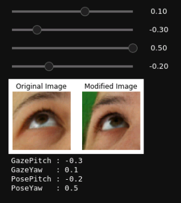
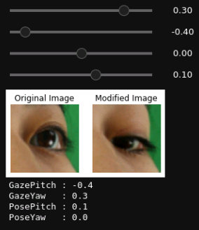

# GazeFlow Demo

This is a simple demo of our proposed paper [GazeFlow: Gaze Redirection with Normalizing Flows]().

Colab:  [GazeFlowDemo]()

## Introduction

In this demo, you can drag the slide bar and you will see the modified eye image.

## Reference

[MokkeMeguru/TFGENZOO](https://github.com/MokkeMeguru/TFGENZOO)